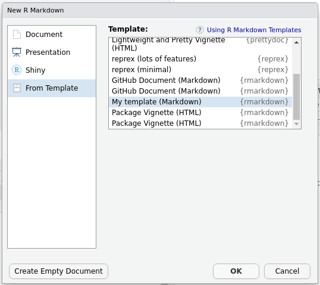

create a template for Rmarkdown
================
Joao Ortigao - R version 4.0.5 (2021-03-31)
2021-07-30

Navigate to the directory where you should store your templates.

``` bash
cd ~/R/x86_64-redhat-linux-gnu-library/4.0/rmarkdown/rmarkdown/templates/
ls -l
```

    ## total 0
    ## drwxr-xr-x. 1 User Group 60 May 18 22:22 github_document
    ## drwxr-xr-x. 1 User Group 60 May 18 22:22 html_vignette

Copy one of the existing templates for customization.

``` bash
cd ~/R/x86_64-redhat-linux-gnu-library/4.0/rmarkdown/rmarkdown/templates/
cp -r github_document my_template
ls -l
```

    ## total 0
    ## drwxr-xr-x. 1 User Group 60 May 18 22:22 github_document
    ## drwxr-xr-x. 1 User Group 60 May 18 22:22 html_vignette
    ## drwxr-xr-x. 1 User Group 60 Jul 30 04:16 my_template

Edit the template.yaml file to get a proper preview in the R markdown
window.

Before:

``` bash
cd ~/R/x86_64-redhat-linux-gnu-library/4.0/rmarkdown/rmarkdown/templates/
cat my_template/template.yaml
```

    ## name: GitHub Document (Markdown)
    ## description: >
    ##   Template for documents to be published as GitHub Flavored Markdown.
    ## create_dir: false

Editing:

``` bash
cd ~/R/x86_64-redhat-linux-gnu-library/4.0/rmarkdown/rmarkdown/templates/
echo "name: My template (Markdown)
description: >
  My templates to be published as GitHub Flavored Markdown.
create_dir: false" > my_template/template.yaml
```

After:

``` bash
cd ~/R/x86_64-redhat-linux-gnu-library/4.0/rmarkdown/rmarkdown/templates/
cat my_template/template.yaml
```

    ## name: My template (Markdown)
    ## description: >
    ##   My templates to be published as GitHub Flavored Markdown.
    ## create_dir: false

Edit the template used to create your Rmd files.

Before edition:

``` bash

cd ~/R/x86_64-redhat-linux-gnu-library/4.0/rmarkdown/rmarkdown/templates/
cat my_template/skeleton/skeleton.Rmd
```

    ## ---
    ## title: "Untitled"
    ## output: github_document
    ## ---
    ## 
    ## ```{r setup, include=FALSE}
    ## knitr::opts_chunk$set(echo = TRUE)
    ## ```
    ## 
    ## ## GitHub Documents
    ## 
    ## This is an R Markdown format used for publishing markdown documents to GitHub. When you click the **Knit** button all R code chunks are run and a markdown file (.md) suitable for publishing to GitHub is generated.
    ## 
    ## ## Including Code
    ## 
    ## You can include R code in the document as follows:
    ## 
    ## ```{r cars}
    ## summary(cars)
    ## ```
    ## 
    ## ## Including Plots
    ## 
    ## You can also embed plots, for example:
    ## 
    ## ```{r pressure, echo=FALSE}
    ## plot(pressure)
    ## ```
    ## 
    ## Note that the `echo = FALSE` parameter was added to the code chunk to prevent printing of the R code that generated the plot.

Editing:

``` bash

cd ~/R/x86_64-redhat-linux-gnu-library/4.0/rmarkdown/rmarkdown/templates/
cat ~/notebook_template.Rmd > my_template/skeleton/skeleton.Rmd
```

After edition:

``` bash

cd ~/R/x86_64-redhat-linux-gnu-library/4.0/rmarkdown/rmarkdown/templates/
cat my_template/skeleton/skeleton.Rmd
```

    ## ---
    ## title: "TITLE"
    ## author: "YOUR NAME - `r R.Version()$version.string`"
    ## date: "`r Sys.Date()`"
    ## output:
    ##   github_document: default
    ##   html_notebook: default
    ##   pdf_document: default
    ## ---
    ## 
    ## WRITE YOUR CODE HERE

restart your R section and select your new template in File\>New File\>R
Markdown…

<!-- -->

Have fun!
